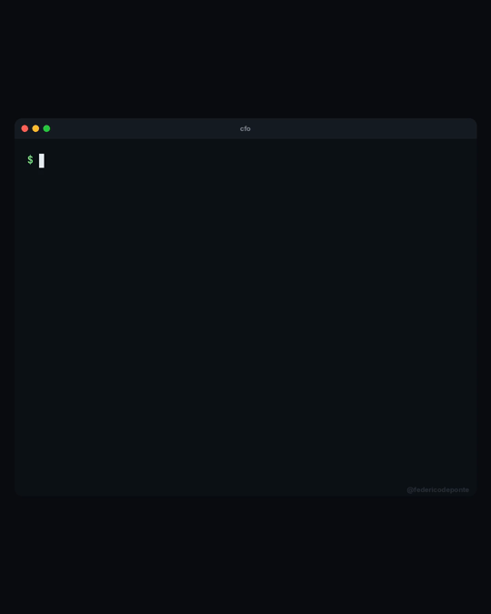

# cfo

**Your Chief Food Officer. An AI agent that searches delivery apps + Google Maps and picks the best restaurant for you.**

Built as a [Claude Code](https://docs.anthropic.com/en/docs/claude-code) skill. It browses delivery platforms with a real browser, cross-references Google Maps ratings, learns your preferences, and makes the call.

<p align="center">
  
</p>

## What it does

1. **Searches delivery apps** - navigates the real website via browser automation, sets your delivery location, searches for your dish/cuisine, collects the top restaurants with ratings, delivery times, and prices
2. **Cross-references Google Maps** - for the top results, checks Google Maps ratings and review counts
3. **Ranks and recommends** - combines both ratings into a weighted score, presents a clean comparison table
4. **Learns your taste** - saves cuisine preferences, rating thresholds, budget range, and favorites to a local file that improves recommendations over time

### Example output

Inside Claude Code:

```
> find me momos near koramangala

  #  Restaurant        Swiggy  Google      Time   Price
  -  ----------------  ------  ---------  -----  ------
  1  Khawa Karpo        4.5    4.4 (890)   25m    ₹350
  2  Momo I Am          4.3    4.2 (1.2k)  35m    ₹300
  3  WowMomos           4.1    3.9 (2.5k)  20m    ₹250

  TOP PICK   Khawa Karpo
  Highest combined rating, reasonable delivery time.

  BUDGET     WowMomos
  Fastest delivery, ₹250 for two.

  [+] Preferences updated
```

## Prerequisites

- [Node.js](https://nodejs.org/) (for Playwright MCP)
- [Python 3](https://python.org/) (for preference tracking)
- [Claude Code](https://docs.anthropic.com/en/docs/claude-code) CLI

## Installation

```bash
# 1. Add Playwright MCP to Claude Code (launches a local headless browser)
claude mcp add playwright -- npx @playwright/mcp@latest

# 2. Clone and install the skill
git clone https://github.com/buildingopen/opencfo.git
cp -r opencfo/skill ~/.claude/skills/cfo
```

Claude Code auto-discovers skills in `~/.claude/skills/`.

## Quick start

Open Claude Code and type:

```
> find me pizza near me
```

That's it. The agent opens a browser, searches your delivery app, checks Google Maps, and returns a ranked table.

The default delivery platform is Swiggy (India). To use a different platform, see [Switching platforms](#switching-platforms).

## Usage

Ask naturally inside Claude Code:

```
> find me ramen near shibuya
> pizza delivery in brooklyn, budget $20
> best tacos near kreuzberg for 4 people
> healthy lunch options near me
> what should I eat for dinner?
```

Or use the slash command:

```
> /cfo pad thai near soho
```

## How it works

```
You: "find me ramen near shibuya"
  |
  |-- 1. Parse request (dish, location, budget, party size)
  |
  |-- 2. Read preferences (learned from past searches)
  |
  |-- 3. Open delivery app in browser
  |      |-- Set delivery location
  |      |-- Search for dish/cuisine
  |      +-- Collect top 10 results (rating, time, price)
  |
  |-- 4. Open Google Maps in new tab
  |      +-- For top 5: get Google rating + review count
  |
  |-- 5. Score = (App x 0.4) + (Google x 0.4) + (reviews x 0.2)
  |
  |-- 6. Present ranked table with top pick highlighted
  |
  +-- 7. Update preferences file for next time
```

## Preference learning

After each search, the skill updates `references/preferences.md`:

```markdown
## Cuisine Preferences
- Ramen/Japanese (high preference, last ordered 2026-02-27)
- Pizza (ordered 2026-02-25)

## Rating Threshold
- Prefers 4.3+ on delivery app, 4.3+ on Google Maps

## Favorites
- Cocolo Ramen (Kreuzberg) - Japanese, ramen

## Order History
| Date       | Restaurant    | Cuisine | Rating | Notes         |
|------------|--------------|---------|--------|---------------|
| 2026-02-27 | Cocolo Ramen | Ramen   | 4.6    | Rich tonkotsu |
```

This builds up over time and influences future recommendations.

## Supported platforms

The skill uses browser automation, so it works with any delivery platform that has a web UI:

| Platform | Region | Status |
|----------|--------|--------|
| Swiggy | India | Tested |
| Wolt | EU, Japan, Israel | Tested |
| UberEats | Global | Supported |
| Lieferando | Germany, NL | Supported |
| DoorDash | US, CA, AU | Supported |
| Deliveroo | UK, EU | Supported |

### Switching platforms

The default is Swiggy. To switch, edit `~/.claude/skills/cfo/SKILL.md` and update **Step 3** with your platform's URL and navigation steps. For example, change `https://www.swiggy.com` to `https://wolt.com` or `https://www.ubereats.com`. The rest of the workflow (Google Maps cross-referencing, scoring, preferences) works the same regardless of platform.

## Project structure

```
opencfo/
|-- skill/                        # Claude Code skill (copy to ~/.claude/skills/cfo)
|   |-- SKILL.md                  # Core instructions + browser workflow
|   |-- references/
|   |   +-- preferences.md        # Auto-learned food preferences
|   +-- scripts/
|       +-- update_prefs.py       # Updates preferences after each search
|-- scripts/
|   +-- cfo.sh                    # CLI wrapper (optional)
+-- README.md
```

## Limitations

- **Browser required** - needs Playwright MCP with a real browser (runs headless locally)
- **Not real-time pricing** - prices shown are listed prices, not final cart price with taxes/delivery
- **Some platforms block bots** - works best with platforms that don't require login for browsing

## Why I built this

Every evening, the same ritual:
1. Open the delivery app, scroll through 200 restaurants
2. Open Google Maps to check if the ratings are real
3. Compare delivery times, prices, portions
4. 20 minutes later, still undecided
5. Order from the same place as yesterday

Now: one command, better recommendation than I'd find manually.

## License

MIT
